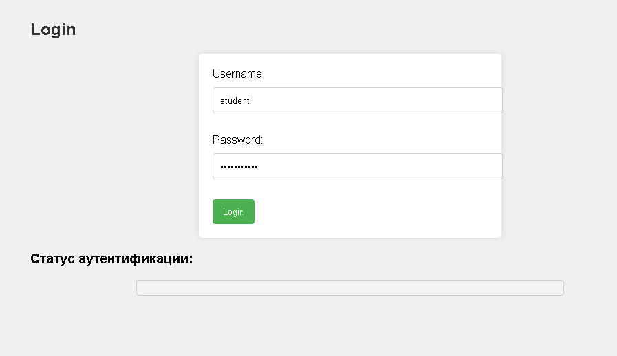
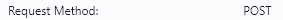
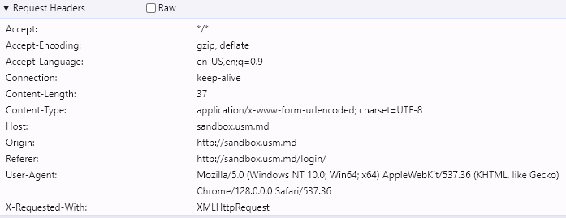

# Lucrare de laborator nr. 1. Bazele HTTP

## Sarcina nr. 1. Analiza cererilor HTTP

    1.Introduceți date incorecte pentru autentificare (de exemplu, username: student, password: studentpass).

    2.Răspundeți la următoarele întrebări:
        Ce metodă HTTP a fost utilizată pentru a trimite cererea? 

        Ce anteturi au fost trimise în cerere?

        Ce parametri au fost trimiși în cerere?
        Ce cod de stare a fost returnat de server?
        Ce anteturi au fost trimise în răspuns?