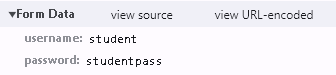
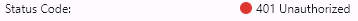
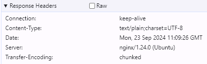
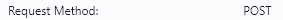
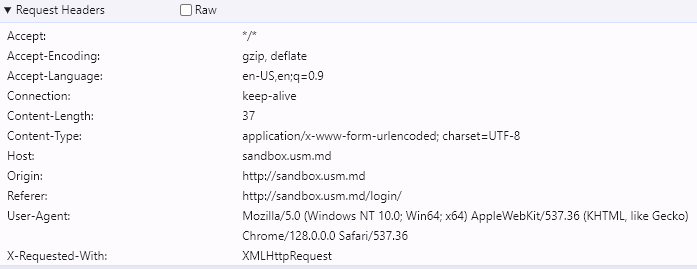
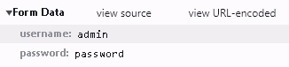
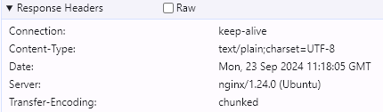

# Lucrare de laborator nr. 1. Bazele HTTP

## Sarcina nr. 1. Analiza cererilor HTTP

1. Introduceți date incorecte pentru autentificare (de exemplu, username: student, password: studentpass).
    

2. Răspundeți la următoarele întrebări:
    - Ce metodă HTTP a fost utilizată pentru a trimite cererea? \
        
    - Ce anteturi au fost trimise în cerere? \
        
    - Ce parametri au fost trimiși în cerere? \
        
    - Ce cod de stare a fost returnat de server? \
        
    - Ce anteturi au fost trimise în răspuns? \
        

3. Repetați pașii, introducând date corecte pentru autentificare (username: admin, password: password).
    - Ce metodă HTTP a fost utilizată pentru a trimite cererea? \
        
    - Ce anteturi au fost trimise în cerere? \
        
    - Ce parametri au fost trimiși în cerere? \
        
    - Ce cod de stare a fost returnat de server? \
        
    - Ce anteturi au fost trimise în răspuns? \
        

## Sarcina nr. 2. Crearea cererilor HTTP
1. Scrieți o cerere de tip GET către server la adresa http://sandbox.com, indicând în antetul User-Agent numele și prenumele dvs. \

GET / HTTP/1.1 \
Host: sandbox.com \
User-Agent: Dorogan Vadim \

2. Scrieți o cerere de tip POST către server la adresa http://sandbox.com/cars, indicând în corpul cererii următorii parametri:
make: Toyota
model: Corolla
year: 2020

POST /cars HTTP/1.1 \
Host: sandbox.com \
make=Toyota&model=Corolla&year=2020 \

3. Scrieți o cerere de tip PUT către server la adresa http://sandbox.com/cars/1, indicând în antetul User-Agent numele și prenumele dvs., în antetul Content-Type valoarea application/json, iar în corpul cererii următorii parametri: json { "make": "Toyota", "model": "Corolla", "year": 2021 }\

PUT /HTTP/1.1 \
HOST: http//:sandbox.com/cars/1 \
User-Agent: Dorogan Vadim \
Content-Type:application/json \
{ \
    "make": "Toyota", \
    "model": "Corolla", \
    "year": 2021 \
} \

4. Scrieți unul dintre posibilele răspunsuri ale serverului la cererea anterioară. http POST /cars HTTP/1.1 Host: sandbox.com Content-Type: application/json User-Agent: John Doe model=Corolla&make=Toyota&year=2020 Presupuneți situațiile în care serverul poate returna codurile de stare HTTP 200, 201, 400, 401, 403, 404, 500. \

200: În cazul în care a fost returnată cererea cu succes dar nu a fost creata o resursă noua.\
201: În cazul în care a fost returnată cererea cu succes și a fost creata o resursă noua.\
400: În cazul în care cererea nu poate fi procesată din cauza erorii în sintaxa.\
401: În cazul în care cererea este neautorizată.\
403: În cazul în care cererea nu are dreptul la acces.\
404: În cazul în care nu este gasit raspuns pentru cerere.\
500: În cazul în care nu poate fi procesata cererea din cauza unei erori pe partea de server.\

5. Scrieți o cerere de tip DELETE la alegerea dvs. și să explicați de ce, în acest caz, este potrivit să utilizați metoda DELETE. \

DELETE /cars/2 HTTP/1.1 \
Host: sandbox.com \
User-Agent: Dorogan Vadim \
Cererea delete este folosită pentru eliminarea unei resurse de pe server. \
